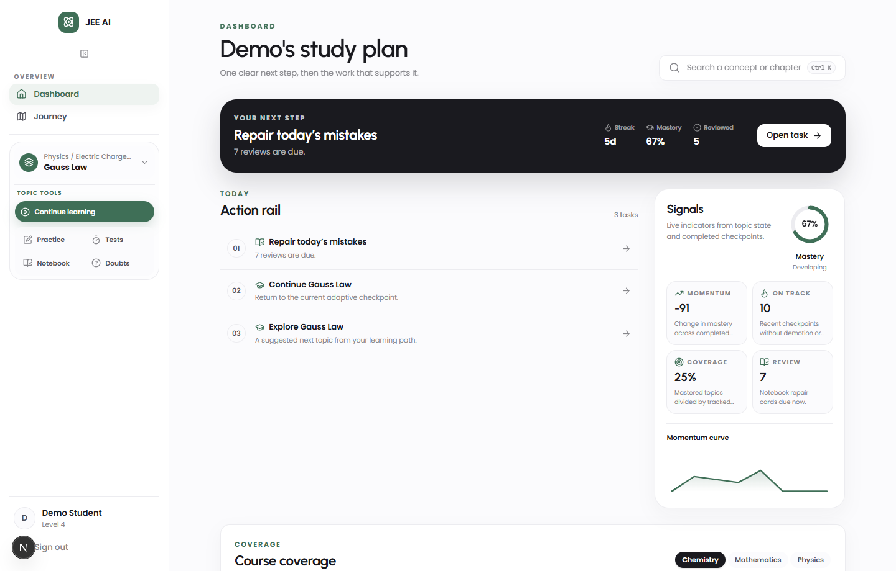
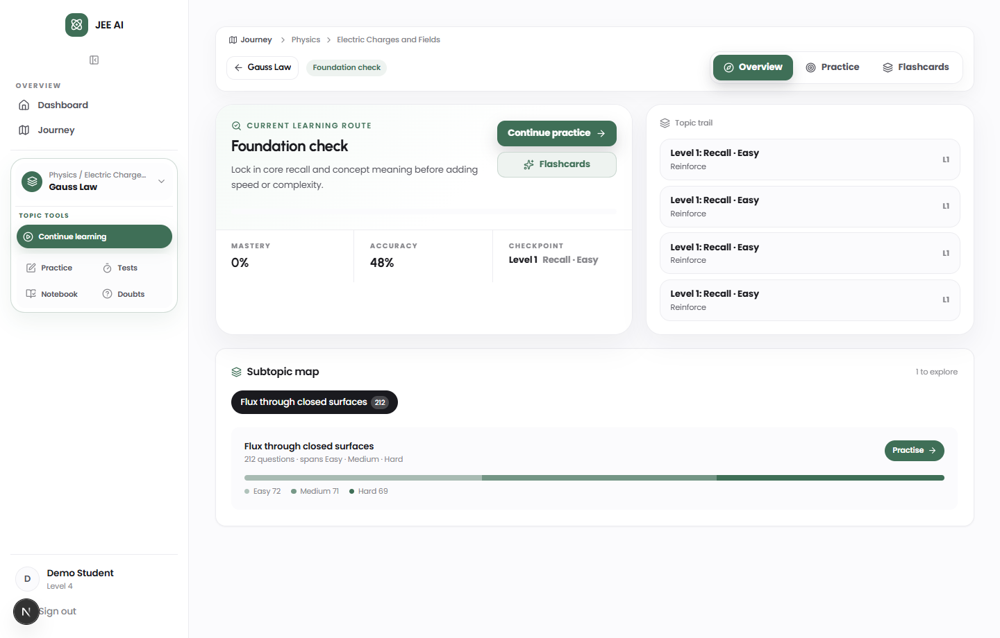
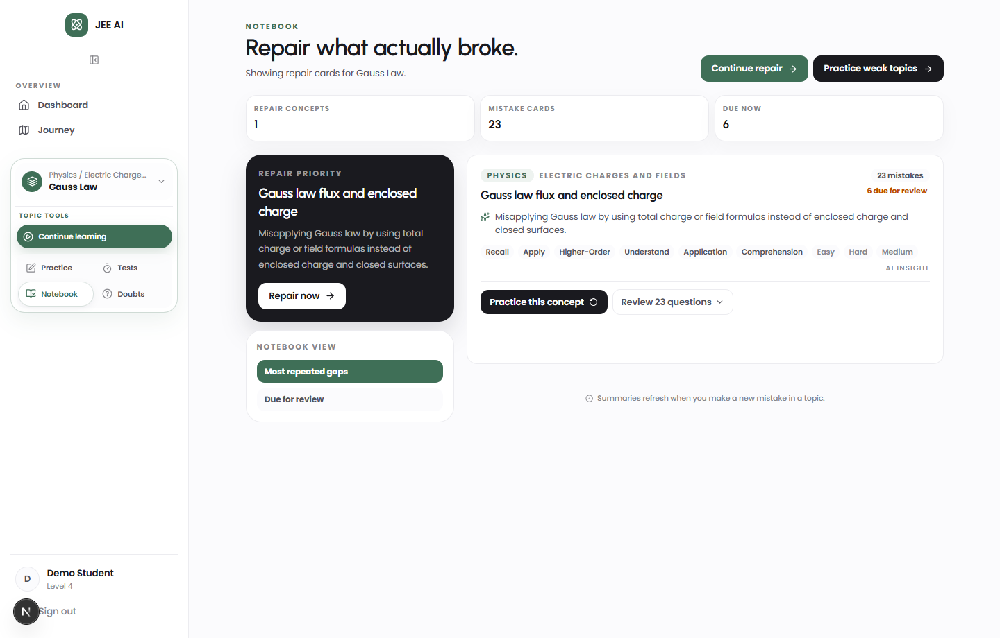
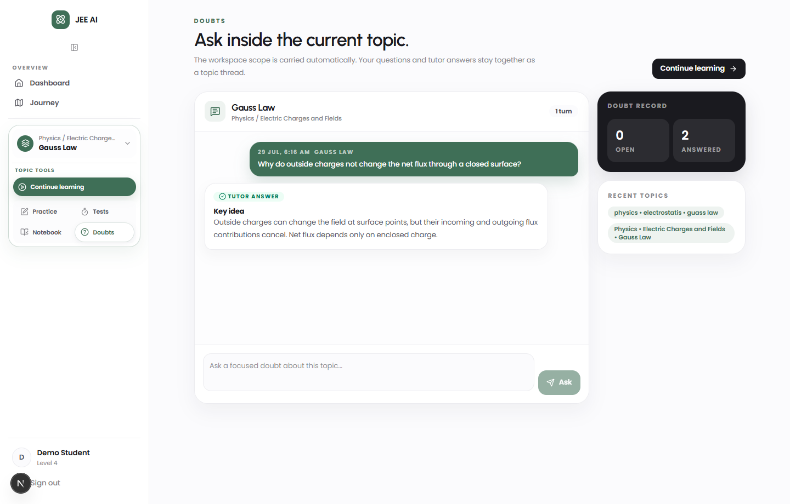
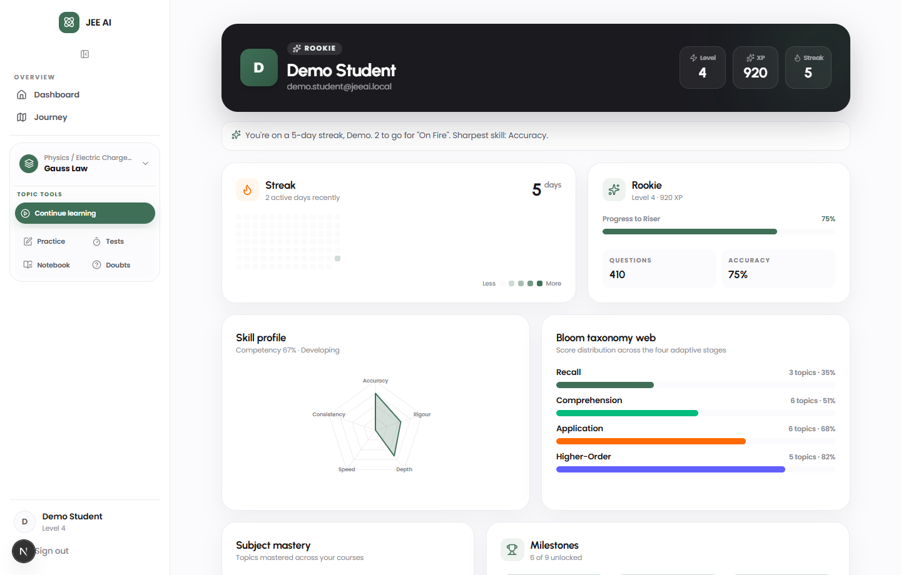

# JEE AI Working Document

This document is the practical product logic reference. It explains what the platform stores, what each tab shows, what updates learner state, and how one area affects another.

## Product inspiration map

The platform is not copied from any one product. These references only influenced a few useful product decisions that fit my own JEE AI workflow.

| Reference platform | What I learned from it | How it appears in JEE AI |
| --- | --- | --- |
| Embibe | Improvement-led preparation works better when the app shows weak areas, practice evidence, and test analysis instead of only a raw score. | Dashboard signals, review queue, weak-topic repair, and topic-level progress are treated as the main student guidance layer. |
| Khan Academy | Mastery learning becomes understandable when progress is broken into skills/topics and learners always know what to practice next. | Topic state, mastery percentage, course coverage, and the "next best action" card are designed around skill-level progress. |
| Vedantu | Doubt solving is valuable when it stays close to the learner's current chapter/topic instead of becoming a disconnected support form. | Doubts inherit the selected workspace subject, chapter, and topic, so the Q&A thread stays linked to the active learning context. |
| Toppr-style practice flows | Practice and tests should quickly move students from question attempts to review, explanation, and retry. | Practice, Tests, Notebook, and Learn are connected through the same topic workspace so mistakes can become repair cards and next actions. |
| Modern productivity dashboards | A dashboard should reduce decisions, not add noise. | The dashboard starts with one next step, then shows compact action rail, signals, coverage, review, and recent learning evidence. |

## UI reference screenshots

These screenshots are captured from the live local app using the demo learner account. They are included as visual references for the exact components described in this working document.

### Dashboard study plan

Shows the current "next step", action rail, signals, and course coverage components described in the Dashboard section.



### Continue Learning topic workspace

Shows the selected topic workspace where adaptive learning, topic trail, accuracy, and tutor flow are presented.



### Notebook repair workspace

Shows the topic-linked repair cockpit for mistakes, due reviews, and concept repair cards.



### Doubts topic thread

Shows the workspace-aware doubt thread where subject/chapter/topic are inherited from the selected topic instead of being re-entered every time.



### Profile skill and taxonomy view

Shows the profile-level XP/level state, skill summary, milestones, and Bloom taxonomy visibility.



## 1. State dictionary

These are the main state groups used across the app. Other sections refer back to these names.

### User profile state

Stored mainly on the user/profile side.

| Field | Meaning | Main source |
| --- | --- | --- |
| `user.id` | Unique learner identity | Auth/session |
| `user.name` | Learner display name | User table |
| `user.email` | Login email | User table |
| `user.xp` | Total experience points | User table, currently updated by Learn correct answers |
| `user.level` | Overall gamified profile level | Derived from XP for display |
| `user.streak` | Consecutive active days | User table |
| tier name | Rookie, Riser, etc. | Derived from `user.level` |

Current profile level rule:

```txt
Displayed user level = floor(user.xp / 250) + 1
Minimum level = 1
```

### Topic state

Stored per user + subject + chapter + topic.

| Field | Meaning | Used by |
| --- | --- | --- |
| `subject` | Physics/Chemistry/Math | Dashboard, Journey, Learn |
| `chapter` | Chapter name | Sidebar workspace, Journey |
| `topic` | Topic name | Learn, Practice, Notebook |
| `currentLevel` | Current adaptive topic level, 1-12 | Learn, Journey, topic workspace |
| `status` | Active, mastered, paused, etc. | Dashboard next step, Journey |
| `totalAnswered` | Total adaptive answers for this topic | Accuracy, competency |
| `totalCorrect` | Total correct adaptive answers for this topic | Accuracy, competency |
| `streakCounter` | Current in-topic correct streak | Learn routing |
| `lastActivityAt` | Last time topic was worked on | Dashboard/recent learning |
| `masteredAt` | When topic was mastered | Journey/profile |

### Learning session state

Stored for each adaptive Learn round.

| Field | Meaning |
| --- | --- |
| `session.level` | Level used for that 5-question round |
| `currentSequence` | Which question is active |
| `totalQuestions` | Usually 5 |
| `status` | Active, completed, routed |
| `transition` | Advanced, reinforced, demoted, mastered, prerequisite |
| `completedAt` | When round ended |

### Answer state

Stored for each submitted adaptive answer.

| Field | Meaning |
| --- | --- |
| `selectedOption` | What learner selected |
| `isCorrect` | Server-graded correctness |
| `attemptNumber` | First or second attempt |
| `elapsedSeconds` | Optional answer time |

### Growth/competency state

Calculated from topic states, learning sessions, and answer aggregates.

| Field | Meaning |
| --- | --- |
| `overall.score` | Weighted competency score |
| `overall.momentum` | Growth movement across completed checkpoints |
| `overall.positiveStreak` | Recent non-regressing checkpoint count |
| `topicsTracked` | Number of topics with state |
| `mastered` | Number of mastered topics |

### Review/notebook state

Created from mistakes and due-review logic.

| Field | Meaning |
| --- | --- |
| review card | A mistake/concept to repair |
| `reviewState` | Due/upcoming/etc. |
| concept summary | AI or backend-generated repair note |
| source | Learn, Practice, Test, Diagnostic, Doubt |

### AI/tutor state

Stored per learning session or doubt.

| Field | Meaning |
| --- | --- |
| tutor conversation | One assistant thread linked to a Learn session |
| tutor messages | Learner/assistant messages |
| pending | Whether assistant is still writing |
| sources | Reviewed concept sources used for grounding |

## 2. XP and user level

### Current implemented XP behavior

Right now, XP is stored as:

```txt
user.xp
```

Current implemented award:

| Action | XP added now |
| --- | ---: |
| Correct adaptive Learn answer | +10 XP |

When XP changes after a correct Learn answer:

```txt
user.xp increases by 10
stored user.level is resynced
frontend auth/dashboard/profile/journey refresh
+XP toast appears from real backend XP change
```

### Intended complete XP model

This is the clean final scoring model to implement through an `xp_events` table.

| Action | Suggested XP |
| --- | ---: |
| Correct Learn answer on first try | +10 |
| Correct Learn answer after hint | +5 |
| Complete a 5-question Learn checkpoint | +20 |
| Advance one topic level | +30 |
| Master a topic | +100 |
| Submit Practice set | +20 |
| Practice score bonus | `scorePercent / 5`, max +20 |
| Submit Test | +30 |
| Test score bonus | `scorePercent / 4`, max +25 |
| Review one due notebook item | +5 |
| Clear a review queue for the day | +20 |
| Daily streak activity | +10 |
| Flashcard review | 0 or very small, recommended 0 for now |
| Doubt asked/resolved | 0 or small support XP, recommended 0 for now |

Recommended event format:

| Field | Meaning |
| --- | --- |
| `userId` | Who earned XP |
| `sourceType` | Learn, Practice, Test, Notebook, Streak |
| `sourceId` | Session/attempt/review ID |
| `points` | XP earned |
| `reason` | Why XP was earned |
| `createdAt` | When it happened |

Clean rule:

```txt
XP controls overall user level.
XP does not control topic level.
```

## 3. User tier names

Tier names are based on overall user level.

```txt
Level 1+  -> Rookie
Level 5+  -> Riser
Level 10+ -> Scholar
Level 20+ -> Achiever
Level 35+ -> Topper
Level 50+ -> Legend
```

Example:

```txt
Level 4 user -> Rookie
```

This is separate from topic level.

## 4. Dashboard tab

Dashboard is the learner’s study plan.

### Your next step

Shows the best immediate action.

Decision order:

```txt
active diagnostic
-> due notebook/review mistakes
-> active topic state
-> suggested topic
-> choose a topic
```

Reads from:

- user profile state
- topic state
- review/notebook state
- diagnostic/practice evidence

Updates:

- no direct state update
- only routes the learner to the right place

### Today / action rail

Shows short tasks for the day in a compact action rail.

Reads from:

- active topic state
- review due items
- recent diagnostic/practice/test evidence

Updates:

- no direct state update
- completed actions update their own modules

### Signals

Shows compact learner signals with hover/inline explanations.

Competency:

```txt
weighted topic score across tracked topics
```

Uses:

- topic accuracy
- current topic difficulty
- Bloom level
- answer speed
- consistency

Momentum:

```txt
latest timeline mastery percent - earliest timeline mastery percent
```

Other signals:

```txt
On track = recent non-regressing checkpoint streak
Coverage = mastered tracked topics / tracked topics
Review = notebook repair cards due now
```

Reads from:

- growth/competency state
- learning sessions
- topic states

Updates:

- changes after Learn sessions/answers create new evidence

### Course coverage

Shows subject/chapter/topic coverage.

Reads from:

- question catalog
- topic states
- growth data

Shows:

- tracked topics
- weak/medium/strong areas
- current coverage

Updates:

- changes when topic states change or more catalog data exists

### Review queue

Shows mistakes/concepts due for repair.

Reads from:

- notebook/review state
- wrong answers
- weak concepts

Updates:

- reviewing items should update review state
- final XP model can award review XP

### Recent learning

Shows latest activity.

Reads from:

- learning sessions
- diagnostic attempts
- practice/test records
- notebook/doubt activity if included

Persistence:

- major records should remain permanent
- feed-style records can be limited to recent history

## 5. Journey tab

Journey shows route and growth summary.

### XP earned

Reads:

```txt
user.xp
```

Current implemented XP source:

```txt
Correct adaptive Learn answer -> +10 XP
```

Future complete source:

```txt
XP events from Learn, Practice, Test, Notebook, Streak
```

### Competency

Reads:

- growth/competency state
- topic states
- answer aggregates

Meaning:

```txt
overall weighted learning score across tracked topics
```

### On track

Reads:

- completed learning sessions
- session transitions

Meaning:

```txt
recent non-regressing checkpoint streak
```

It stops counting when a demotion or prerequisite routing appears.

### Steps cleared

Reads:

- selected Journey route nodes

Meaning:

```txt
completed nodes in the currently selected Journey map
```

It is route-specific, not global.

## 6. Continue Learning / Learn tab

Learn is the main adaptive engine.

### Topic level structure

There are 12 topic levels.

```txt
1  Recall · Easy
2  Recall · Medium
3  Recall · Hard
4  Comprehension · Easy
5  Comprehension · Medium
6  Comprehension · Hard
7  Application · Easy
8  Application · Medium
9  Application · Hard
10 Higher-Order · Easy
11 Higher-Order · Medium
12 Higher-Order · Hard
```

### Baseline / placement

Reads:

- same chapter answered count
- same chapter accuracy
- same chapter mastered topics
- same subject answered count
- same subject accuracy
- same subject mastered topics
- prerequisite mastery
- peer/topic level signal

Placement mapping:

```txt
readinessScore >= 6 -> Level 11
readinessScore 5    -> Level 9
readinessScore 4    -> Level 7
readinessScore 3    -> Level 5
readinessScore 2    -> Level 3
otherwise           -> Level 1
```

If topic state already exists:

```txt
resume saved topic level
```

### Level movement

Each adaptive round has 5 questions.

Advance:

```txt
4/5 or 5/5 first-try correct -> move up one topic level
```

Reinforce:

```txt
0/5 to 3/5 first-try correct -> stay same topic level
```

Demote:

```txt
second failure on a question -> move down one topic level
```

Prerequisite:

```txt
Level 1 + second failure + prerequisite exists -> route to prerequisite
```

Master:

```txt
clear Level 12 -> topic becomes mastered
```

### Topic trail

Reads:

- topic state
- learning sessions
- Journey route

Meaning:

```txt
the learner’s saved progress inside the selected topic route
```

### Accuracy

Reads:

- `topicState.totalAnswered`
- `topicState.totalCorrect`

Formula:

```txt
accuracy = totalCorrect / totalAnswered
```

Example:

```txt
8 correct / 12 answered = 67%
```

### What Learn updates

Learn updates:

- topic current level
- topic status
- total answered
- total correct
- streak counter
- learning session transition
- tutor messages
- XP for correct answers
- profile level sync after XP

Learn does not depend on frontend temporary data.

## 7. Tutor behavior

Tutor is linked to the current adaptive Learn session.

### First wrong answer

```txt
first wrong attempt
-> Socratic hint
-> correct answer remains hidden
```

The correct answer is not sent to the tutor prompt.

### Second wrong answer

```txt
second wrong attempt
-> explanation allowed
-> tutor can explain why wrong and why correct
```

### Manual tutor chat

```txt
answer not revealed -> hint only
answer resolved/revealed -> full explanation allowed
```

Stored in:

- tutor conversations
- tutor messages

## 8. Flashcards

Flashcards are a recall tool.

Reads:

- selected topic
- AI-generated flashcard content
- optional review/rating state

Can store:

- topic
- card content
- user rating
- reviewed count
- next due date, if spaced repetition is enabled

Does not update:

- topic level
- mastery
- competency
- user level

Recommended XP:

```txt
Flashcards -> 0 XP for now
```

Reason:

Flashcards are for recall support, not the main grading engine.

## 9. Practice tab

Practice is for training and review evidence.

Reads:

- selected topic/chapter
- question catalog
- practice attempts
- answer records

Updates:

- practice history
- score
- weak concepts
- review/notebook items
- recommendations
- XP in future XP-event model

Does not directly update:

- topic level
- topic mastery

Clean rule:

```txt
Practice creates evidence.
Learn changes topic level.
```

## 10. Test tab

Test is for exam-style assessment.

Reads:

- question catalog
- selected topic/chapter/subject
- test configuration

Updates:

- test history
- score
- weak areas
- analytics
- notebook/review queue
- recommendations
- XP in future XP-event model

Does not directly update:

- topic level

Reason:

Test performance can be affected by timing, mixed topics, pressure, and exam behavior. It should influence evidence and recommendations, not directly promote/demote topic level.

## 11. Notebook tab

Notebook is the repair cockpit.

Reads:

- wrong answers
- due review cards
- weak concepts
- AI explanations
- concept summaries

Updates:

- review state
- due/upcoming repair queue
- dashboard next step
- possible XP in future XP-event model

Does not directly update:

- topic level

Current UI behavior:

- if opened with a workspace scope, it filters to that topic
- shows repair concepts, mistake cards, and due-now count
- highlights the top repair priority
- groups mistakes by concept
- renders questions, answers, and solutions through `StudyMarkdown` with KaTeX

Current source truth:

```txt
Notebook cards currently come from Learn/adaptive and Practice mistake flows.
Test mistakes should be wired into the same notebook source path when backend support is added.
```

## 12. Doubts tab

Doubts is for learner questions inside or outside a workspace.

Reads:

- learner question
- selected topic/chapter when available
- reviewed concept sources when available

Stores:

- doubt question/title
- AI response
- status
- sources/citations

Does not directly update:

- topic level
- mastery
- user level

Current UI behavior:

- if opened from a selected topic workspace, subject/chapter/topic are carried automatically
- the learner only types the doubt
- previous doubts for that topic are shown as one continuing topic thread
- each saved doubt remains a backend record, but the UI presents it like a chat
- if opened without workspace scope, subject/chapter/topic inputs are still shown

AI behavior:

```txt
question -> backend doubt record -> grounded AI answer -> saved answer + sources
```

This is not the same as the Learn tutor session. Learn tutor is tied to a live adaptive question; Doubts are standalone concept questions.

## 13. Profile tab

Profile owns identity, gamification, and skill shape.

Reads:

- user profile state
- growth/competency state
- subject coverage
- diagnostic history
- recent activity

Shows:

- user level, XP, streak
- XP/tier progress
- activity heatmap
- competency radar
- Bloom taxonomy web
- subject mastery
- compact milestones

Important separation:

```txt
Profile = who the learner is becoming
Journey = where the learner is moving
Dashboard = what the learner should do next
```

Achievements are intentionally secondary. They are milestones, not the main measurement system.

## 14. What affects what

### Topic level

Affected by:

```txt
Learn adaptive answers only
```

Not directly affected by:

```txt
XP
Practice
Test
Flashcards
Notebook
Doubts
Dashboard navigation
```

### User XP

Current implemented:

```txt
Correct Learn answer -> +10 XP
```

Recommended final:

```txt
Learn + Practice + Test + Notebook review + streak bonuses -> XP events
```

### User profile level

Affected by:

```txt
user.xp
```

Formula:

```txt
floor(user.xp / 250) + 1
```

### Competency

Affected mainly by:

```txt
topic states
answer accuracy
topic difficulty
Bloom level
speed
consistency
```

### Dashboard recommendations

Affected by:

```txt
active learning state
review due items
diagnostics
practice/test evidence
weak topics
recent activity
```

### Review queue

Affected by:

```txt
wrong answers
due notebook items
weak concepts
practice/test/diagnostic mistakes
```

## 15. Final product rule

```txt
Dashboard decides what the learner should do next.
Journey shows growth and route.
Learn teaches and changes topic level.
Practice trains and creates evidence.
Test measures readiness and creates stronger evidence.
Notebook repairs mistakes.
Doubts explains learner questions.
Flashcards support recall.
Profile shows gamified user progress from XP.
```
