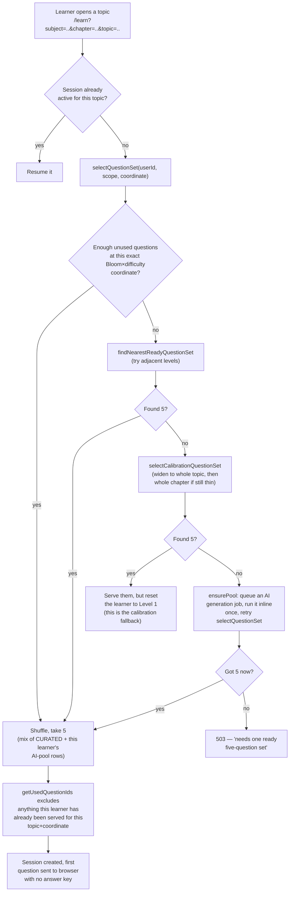
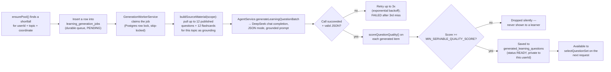
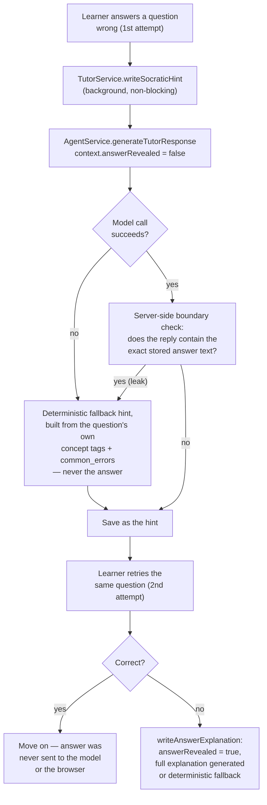
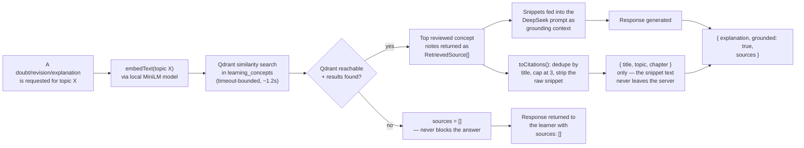

# AI models, question dataset, and data flow

Answers three things: which models the platform runs, where the question data actually comes from, and how a question travels from the database to the learner's screen. All diagrams reflect the code as of this doc's last update — re-check `agent.service.ts` / `adaptive-content.service.ts` if behavior looks different.

## 1. Models in use

| Purpose | Model | Provider | Where |
| --- | --- | --- | --- |
| Chat/generation (questions, hints, explanations, doubts, revisions) | `deepseek-chat` (configurable via `DEEPSEEK_MODEL`) | DeepSeek, OpenAI-compatible API | `src/agent/agent.service.ts` |
| Text embeddings (RAG retrieval) | `Xenova/all-MiniLM-L6-v2`, 384-dim | Runs **locally**, in-process, via `@huggingface/transformers` — no external API call, no per-request cost | `src/agent/embedding.util.ts` |
| Vector store | Qdrant, collection `learning_concepts` | Self-hosted/managed Qdrant instance | `src/agent/embedding.service.ts` |

`AgentService` is the **single LLM boundary** for the entire backend — every other module (adaptive, doubts, notebook, practice, diagnostics, questions) calls into it; nothing else talks to DeepSeek or Qdrant directly. This is a deliberate architectural rule (see `AGENTS.md` §4), not an accident — it's what makes the fallback behavior (offline hints, deterministic explanations) consistent everywhere: one place to add a timeout, one place to add a fallback, one place that can never leak an API key to the browser.

**Current status:** the DeepSeek key is out of API credit (`402 Insufficient Balance`), so every generation call falls back to a deterministic, database-backed response right now — see the "AI unavailable" fixes made earlier in this session. Qdrant/embeddings are independent of that and keep working.

## 2. The question dataset

There is no separate "dataset file" (no CSV/JSON question bank) — every question lives in PostgreSQL, in one of two tables:

| Table | Who writes it | Visible to learners? |
| --- | --- | --- |
| `questions` | Hand-authored seed scripts (`src/scripts/seed-*.ts`, ~20 of them, one per chapter) and the admin content-review pipeline | Only rows with `status = PUBLISHED` |
| `generated_learning_questions` | The adaptive engine's background worker, generated by DeepSeek per learner+coordinate | Only to the learner it was generated for — never public |

**Live counts** (queried directly from the production database while writing this doc):

- **491 published questions**, all currently `source = CURATED` (no AI-generated question has been promoted to the public bank yet — that requires an explicit admin publish action).
- Split by subject: **Physics 392, Mathematics 63, Chemistry 36** — Physics is 80% of the bank, and within Physics, **"Electric Charges and Fields" alone is 282 questions** (72% of all Physics content). Most other seeded chapters sit at exactly 9 questions each (one Easy/Medium/Hard × Bloom-level seed batch). This is a real content-coverage gap, not a selection bug — see `docs/AI-FEATURES-ROADMAP.md` and the coverage endpoint (`GET /api/learning/coverage`) for the audit tool that surfaces it per topic.
- **52 topics** defined in the curriculum tree (`topics` table).
- **112 published flashcards.**
- **168 AI-generated questions** currently sitting in 6 learners' private pools (105 ready to serve, 63 reserved into an active session) — generated before the DeepSeek key ran out of balance.
- **Zero draft questions** — the admin review queue (draft → published/archived) exists in code but has nothing pending right now.

Every question row carries: `question_text`, `options`, `correct_answer`, `solution`, `hint`, `concept_tags`, `common_errors` (misconception strings), `bloom_level`, `difficulty`. The frontend never receives `correct_answer` or `solution` until the question is answered/submitted — that redaction happens server-side, per endpoint (see the flow diagrams below).

## 3. How a question gets selected (adaptive Learn tab)

**The exclusion rule that actually matters:** a question is only ever re-served to the *same learner* if they've never seen it before at that exact topic + Bloom level + difficulty coordinate (`getUsedQuestionIds` in `adaptive-content.service.ts`). It does **not** check content similarity — two differently-worded questions testing the identical idea are treated as fully distinct. That's the mechanism behind the "questions feel repetitive" issue diagnosed earlier this session (thin coverage + near-duplicate seeded content, not a selection-logic bug).

## 4. How an AI question gets generated (background pool worker)

Generated questions are **never** written into the public `questions` table — that boundary is enforced in code, not just policy. The only way a question reaches the shared bank is an explicit admin publish action in the content-review UI.

## 5. Tutor hint / explanation flow (answer-reveal boundary)

The answer key is withheld from the model prompt itself for a first miss — it isn't just hidden from the UI. A second, independent server-side check re-scans whatever the model actually returned and swaps in the safe fallback if it ever states the answer anyway.

## 6. RAG citation flow (doubts, revisions, explanations)

Grounding is always best-effort: an unreachable or empty Qdrant never fails the request, it just means an ungrounded (but still generated, or fallback) answer with `sources: []`.

## 7. Where to look in code

| Concern | File |
| --- | --- |
| Question selection (adaptive) | `learning-platform-backend/src/adaptive/adaptive-content.service.ts` |
| Question selection (Practice/Tests) | `learning-platform-backend/src/practice/practice.service.ts`, `src/diagnostics/diagnostics.service.ts` |
| All model calls | `learning-platform-backend/src/agent/agent.service.ts` |
| Embeddings | `learning-platform-backend/src/agent/embedding.util.ts`, `embedding.service.ts` |
| Tutor hint/explanation + answer-reveal boundary | `learning-platform-backend/src/adaptive/tutor.service.ts` |
| Background question generation worker | `learning-platform-backend/src/adaptive/generation-worker.service.ts` |
| Seed scripts (how the 491 curated questions got there) | `learning-platform-backend/src/scripts/seed-*.ts` |
